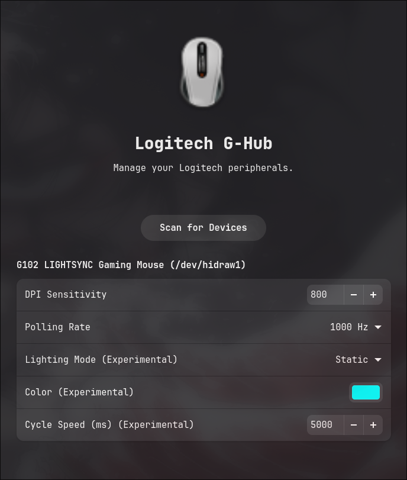

# Logitech G-Hub Plugin

**Logitech G-Hub Plugin** is a lightweight, open-source alternative to G-Hub for Linux, integrated into Kerneldrive. It communicates directly with Logitech devices using the HID++ 2.0 protocol.

---

## Features

- **DPI Control**: Fine-tune sensor sensitivity (e.g., 400, 800, 1600 ... 25600 DPI).
- **Polling Rate**: Adjust report rate (125Hz, 250Hz, 500Hz, 1000Hz).
- **RGB Lighting (Experimental)** doesnt work for now:
    - **Modes**: Static, Breathing, Color Cycle.
    - **Custom Colors**: Pick any color for your device lighting.
    - **Speed**: Adjust animation speed.
- **Configuration Rice**: Robust persistence via `.ini` files.

---

## Configuration ("Rice")

Settings are automatically saved and applied per-device.

*   **Location**: `~/.config/kerneldrive/logitech_ghub/`
*   **Files**:
    *   `mouse.ini`: Stores DPI and Polling Rate using `[Device Name]` as sections.
    *   `rgb.ini`: Stores Lighting Mode, Color, and Speed.

---

## Usage

1. Download [KernelDrive](https://github.com/acedmicabhishek/KernelDrive)
2. Open KernelDrive → Plugin Store → Search **Logitech G-Hub** → Install
3. Connect your mouse and configure
